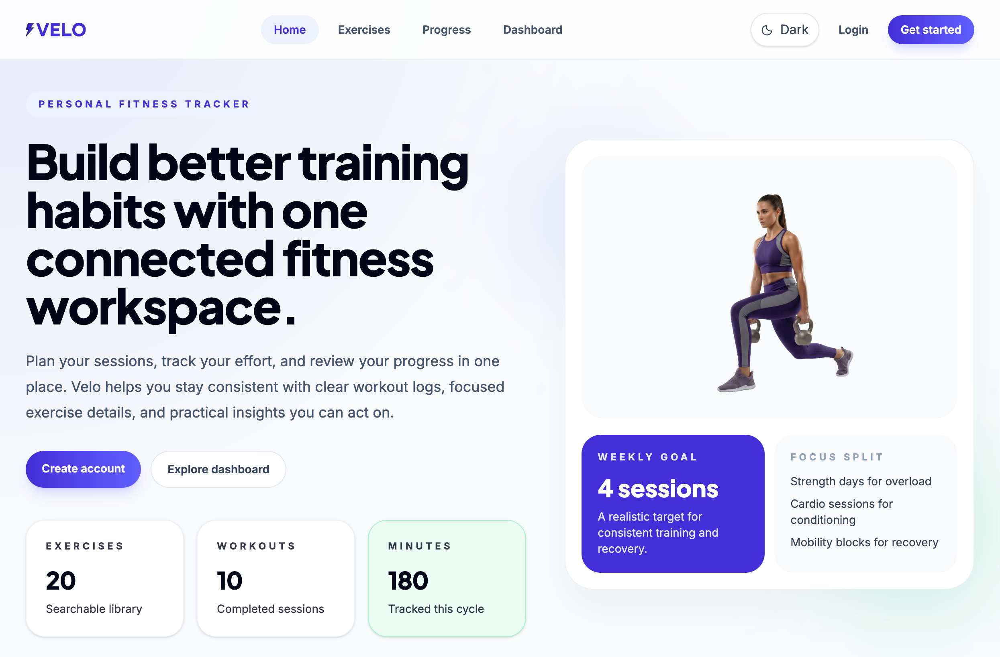
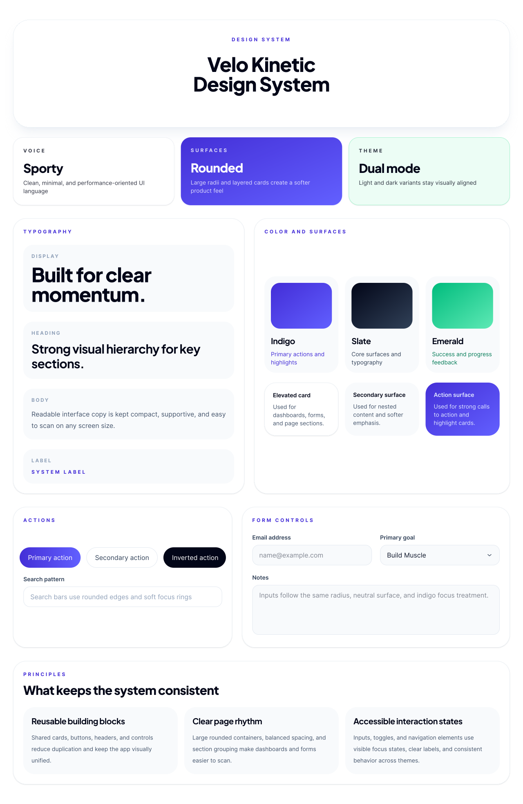

<div align="center">
  <svg
        aria-hidden="true"
        focusable="false"
        width="260"
        height="59"
        viewBox="0 0 75 17"
        fill="none"
        xmlns="http://www.w3.org/2000/svg"
      >
        <path
          d="M66.3817 0C71.5828 3.18898e-05 74.7602 3.50064 74.7602 8.44394V8.46753C74.7602 13.4344 71.5828 16.935 66.3817 16.935H66.3578C61.1563 16.935 57.9793 13.4344 57.9793 8.46753V8.44394C57.9793 3.50067 61.1563 4.19655e-05 66.3578 0H66.3817ZM21.1785 12.3701L25.6032 0.28391H29.2513L23.0378 16.6511H19.2955L13.0822 0.28391H16.7302L21.1785 12.3701ZM42.4028 3.54792H34.7772V6.85909H41.5083V10.1231H34.7772V13.3871H42.4028V16.6511H31.294V0.28391H42.4028V3.54792ZM48.6824 13.2925H56.9908V16.6511H45.1989V0.28391H48.6824V13.2925ZM66.3578 3.264C63.3215 3.26405 61.4624 5.41649 61.4624 8.44394V8.46753C61.4624 11.5186 63.3215 13.671 66.3578 13.671H66.3817C69.4176 13.671 71.2767 11.5186 71.2767 8.46753V8.44394C71.2767 5.41649 69.4176 3.26405 66.3817 3.264H66.3578Z"
          fill="#432DD7"
        />
        <g clip-path="url(#clip0_289_3411)">
          <path
            d="M3.07572 0.0566281L9.40607 -9.39003e-05C9.52282 -0.00562775 9.64245 0.0248084 9.74767 0.0912147C10.0086 0.258614 10.0792 0.598946 9.90333 0.849353L6.59691 5.58633H9.40031V5.58772C9.52715 5.58772 9.65542 5.62784 9.76208 5.71223C10.0042 5.90453 10.0403 6.24763 9.83991 6.48143L1.00884 16.8007C0.856058 16.9792 0.595175 17.0511 0.358796 16.9612C0.0662045 16.8505 -0.0764879 16.5323 0.0402604 16.2515L3.07283 8.92325L0.799845 8.90249C0.734985 8.90664 0.670125 8.90111 0.603823 8.88313C0.301143 8.80012 0.125299 8.49714 0.21178 8.20661L2.53233 0.453682H2.53377C2.60008 0.226794 2.81628 0.059395 3.07572 0.0566281Z"
            fill="#383838"
          />
          <path
            fill-rule="evenodd"
            clip-rule="evenodd"
            d="M9.43068 0.546509L3.08015 0.603231L0.759592 8.35616L3.90747 8.38521L0.569336 16.4536L9.40041 6.13432H5.52754L9.43068 0.546509Z"
            fill="#432DD7"
          />
          <path
            fill-rule="evenodd"
            clip-rule="evenodd"
            d="M4.88614 0.625366L3.12194 0.657186L0.897961 8.31327L3.92621 8.37968L0.569336 16.4536L5.07496 7.61324L2.38975 7.1733L4.88614 0.625366Z"
            fill="#24129E"
          />
        </g>
        <defs>
          <clipPath id="clip0_289_3411">
            <rect width="10" height="17" fill="white" />
          </clipPath>
        </defs>
      </svg>
</div>

<div align="center">
  
</div>

# Velo 2.0.0
Velo is a responsive frontend web application developed for CSC443 Phase I. It allows users to register, log in, browse exercises, log workouts, view workout details, and track fitness progress using mock data and local React state (Phase I only).

## Team
- [Mohammad Ibrahim](mailto:mohammad.ibrahim07@lau.edu) (Lead)
  - Set up the main project foundation with React, Vite, Tailwind CSS, and routing.
  - Built shared UI components such as the navbar, footer, theme toggle, brand mark, and homepage components.
  - Added global light/dark theme styling and deployment configuration.
  - Updated branding assets and maintained the README and initial project documentation.
- [Batoul Zeineddine](mailto:batoul.zeineddine@lau.edu)
  - Built the exercise library page.
  - Built the exercise details page.
  - Built the workout logging page.
  - Built the workout details page.
  - Added reusable components like the search bar and exercise card.
  - Connected the related routes for workout and exercise features.
- [Mahdi Yassine](mailto:mahdi.yassine01@lau.edu)
  - Built the login page.
  - Built the register page.
  - Added user/account handling with AppDataContext.
  - Improved accessibility across the app with ARIA labels and related fixes.
  - Fixed dark mode form styling and input/select UI issues.
  - Fixed navbar behavior on the register page.
  - Updated the homepage hero image.
- [Khalil Hassan](mailto:khalil.hassan@lau.edu)
  - Built the dashboard page.
  - Added dashboard summary cards and recent workout content.
  - Added the dashboard route.
  - Added shared app page support such as the page header.

## Topic
Personal Fitness Tracker

## Primary Data Entities
- User
- Workout
- Exercise
- Progress Record

## Tech Stack
- React
- React Router
- Tailwind CSS
- JavaScript (ES6+)
- Vite
- Git & GitHub

## Pages
- Homepage
- Login
- Register
- Workout Dashboard
- Exercise Library
- Workout Details
- Log New Workout
- User Progress

## Velo Kinetic - Design System
<div align="center">
  
</div>

- Uses `Plus Jakarta Sans` for headings and `Inter` for body text and UI labels.
- Uses indigo as the main brand color, slate tones for surfaces and text, and emerald for success/progress highlights.
- Uses rounded cards, soft shadows, and consistent spacing to keep the interface clean and modern.
- Reuses shared components such as the navbar, footer, page headers, stat cards, workout cards, search bars, and form controls.
- Supports both light mode and dark mode with consistent colors, contrast, and interaction states.
- Keeps the overall style sporty, minimal, and easy to navigate across all pages.

## Deployed Application
- https://mhmdibrahimm.github.io/csc443-web-project/

- tutorial credits to [this repo](https://github.com/gitname/react-gh-pages)

## GitHub Repository
https://github.com/mhmdibrahimm/csc443-web-project/

## Local Setup
```bash
npm install
npm run dev
```
## React Compiler

The React Compiler is enabled on this project. See [this documentation](https://react.dev/learn/react-compiler) for more information.

Note: This will impact Vite dev & build performances.
